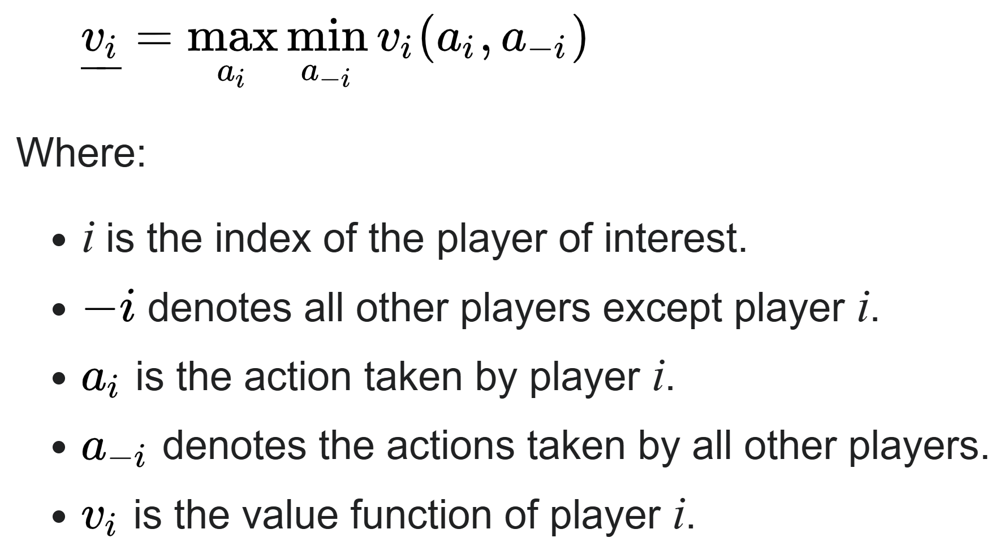

# What is Minimax Algorithm?
Minimax is a decision rule used in AI for minimizing the possible loss for a worst case (maximum loss) scenario. When dealing with gains, it is referred to as "maximin" – to maximize the minimum gain. 

# Game Theory

The maximin value is the highest value that the player can be sure to get without knowing the actions of the other players; equivalently, it is the lowest value the other players can force the player to receive when they know the player's action. 

The formal defintion: 

